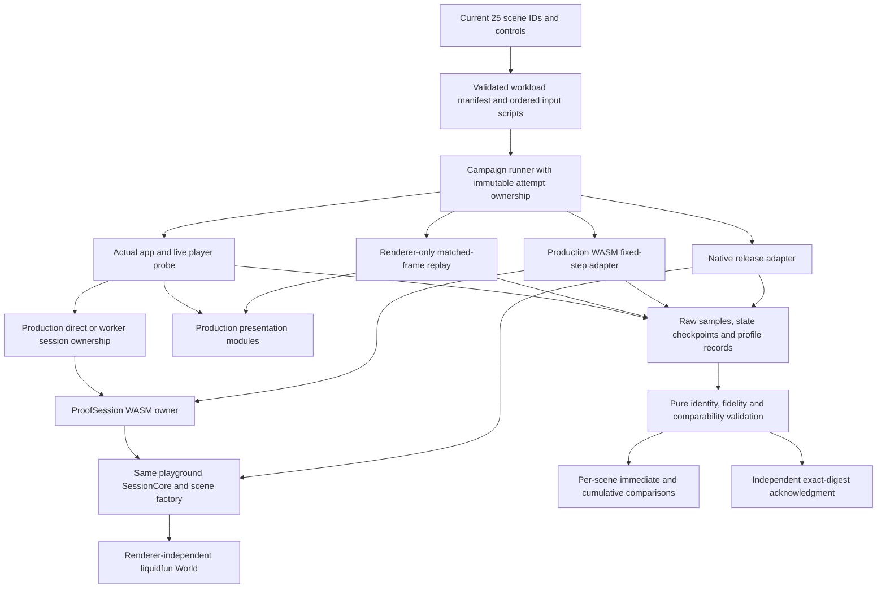

# Architecture Patterns: v1.4 Scenario Performance

**Domain:** Native Rust and browser playground performance with preserved behavior and fidelity
**Researched:** 2026-10-03
**Confidence:** HIGH for existing source boundaries; MEDIUM for proposed harness design pending implementation
**Scope:** Phase 34 builds the generalized harness and completes the original 25-scene campaign. Phases 35–59 each own exactly one current scene and its fresh before/profile/fix/after cycle. Phase 60 closes the whole campaign on the final source. Memory increases may support speed; no approximation, lower fidelity or guaranteed-gain assumption.

## Governing constraints

Apply current `AGENTS.md`, `AGENTS.bright-builds.md`, `standards-overrides.md`, `PROJECT-SCOPE.md`, and architecture/verification standards before historical production gates. Native Rust remains the renderer-independent engine. The private `liquidfun-wasm` crate already owns the actual playground scene constructors and a native-testable session; use that path for scene benchmarks rather than recreating a similar testbed catalog. Published `liquidfun` must remain Cargo-only and independent of browser tools/C++.

Keep expensive experiments manual and local macOS evidence explicit. Strict Linux, dedicated host, exhaustive C++ parity and release qualification are optional. Package publication is outside this milestone. Existing failed evidence remains immutable; a failure means diagnose, correct, and record a fresh attempt, not a new approval request for routine iteration.

This artifact is the delegated architecture research step. Only this file is owned by this step; the separate [FEATURES.md](FEATURES.md) remains the source for the concrete 25-scene workload inventory. No benchmark execution or implementation was performed.

## Recommended architecture

Use one versioned, validated workload model and four execution adapters around existing production modules. Keep comparison, evidence validation and coverage calculation pure. Put filesystem/process/browser/profiler effects in thin tooling owners. Do not add a published crate, generic benchmark framework, renderer dependency to core, or parallel solver merely to cover 25 workloads.



### Component boundaries

Suggested paths are future implementation proposals, not files claimed to exist. Reuse the existing Tesla modules where their behavior is applicable, without changing their historic schema/evidence semantics.

| Component | Responsibility | Proposed location / existing integration seam | Must not own |
| --- | --- | --- | --- |
| Workload model | Parse schema, scene/control tokens, epochs, ordered input events, warmup/windows/checkpoints, render profiles and replicate policy. | `web/scripts/bench-scenarios/model.ts` plus checked-in workload data; Rust native adapter parses the same data. | Timers, world physics, browser selection, evidence acceptance. |
| Campaign model | Validate one immutable original campaign, one scene per optimization phase, predecessor references and final coverage. | `web/scripts/bench-scenarios/campaign.ts` or equivalent small pure module. | Running simulations, modifying accepted reports, hidden source rebuilding. |
| Runner | Build/identify artifacts, reserve a fresh directory, run cases sequentially, persist successes/failures, close child/browser owners. | `web/scripts/bench-scenarios.ts`; optional thin just/xtask commands. | Solver implementation or substantial foreign-language code embedded in strings. |
| Native adapter | Execute the real private scene factory/session with frozen presets/scripts; ordinary release samples and separate profiled replay. | Private native module/bin in `crates/liquidfun-wasm`, parallel to existing `scene_spot.rs`. | A second scene implementation, C++ runtime, rendering, universal 10s assumptions. |
| WASM fixed-step adapter | Load freshly built production module, apply scripts exactly, time advance/capture/parse boundaries and collect named exported state. | Generalized private browser fixture under `web/benchmarks/scenarios/`; reuse loader/frame/parser/session contracts. | Synthetic physics, replacing normal-player throughput evidence, public app diagnostics. |
| Renderer replay adapter | Feed identical recorded frames to production painter under frozen camera/mode/DPR and record submission/resource costs. | Same private fixture, calling `presentSceneFrame`. | Advancing physics during renderer-only samples, claiming submission is GPU completion. |
| App-player probe | Open built actual app, observe normal lifecycle/control/RAF ownership and latency/cadence, assert backend identity. | Playwright tooling plus narrowly scoped observation injection/seams around real player; production shell remains authoritative. | Using a synthetic media clock as ordinary playback, or excluding chrome silently. |
| Profiler adapter | Replay exact case/windows on identified diagnostic build, retain raw traces and connect hotspots to source functions. | Existing native `step_profiled`, optional allocator mode and existing browser/native profiling tools. | Timing authority, silently reusing a different world/build/load. |
| Identity/evidence store | Hash path+content manifests and binaries, record environment, write create-only raw files, fail on drift/overwrite. | Generalize patterns in `bench-tesla/identity.ts` and `results.ts`; a new versioned namespace. | Optimistic passing status, selecting fastest replicate, rewriting old Tesla reports. |
| Validator/comparator | Validate schema, relationships, actual counts, scripts, source/runtime comparability and semantic/appearance evidence. | Pure modules and meaningful fixture tests. | I/O-driven implicit acceptance, best-result selection or waiving fidelity. |

## What already exists and what must change

| Existing seam | Verified current behavior | Milestone implication |
| --- | --- | --- |
| Rust scene factory | Parses exactly 25 lowercase IDs and constructs each production scene. | Native harness should call this source, not the separate testbed/compatibility catalog. Catalog equality becomes a coverage invariant. |
| `SessionCore` | Owns `World`, particle system and hooks; accepts 1–4 fixed advances; executes pre-hook, escaped-particle eviction, step, post-hook; supports controls/actions/pointers/gravity. | A release adapter times complete session advance; deeper `World` timing is a separately labeled boundary. Preserve hooks and eviction in scene throughput. |
| Native diagnostic profile | `advance_profiled` is native-only; existing Dam Break timers mark themselves `not_timing_authority`. | Expand diagnostic workload coverage, never substitute profiled samples for before/after unprofiled results. Hooks/capture outside world profile need separate attribution. |
| Native spot check | Exactly five IDs; fixed default warmup60/measured120; no general interaction manifest. | It is a regression/smoke starting point, not all-scene campaign evidence. |
| `ProofSession` | WASM bridge wraps the same `SessionCore`; `captureFrame` returns owned data. | Exact workload recipes can share constructors between native and WASM even though numeric/performance results are separate platform identities. |
| Initial vs live particle count | Session stores construction `particle_count`; live capture uses particle-system view; native helper can snapshot live count. | Do not log `ProofSession.particleCount()` as a post-emission/death/drawing live count. Use captured frame counts or dedicated validated live queries. |
| Direct browser owner | `createSceneSession` exactly-once owns generated session, advance→capture→parse→raw-free; invalid step or failure poisons/frees owner; invalid pointer is ignored; gravity rejection differs from fatal operations. | Optimizations preserve established failure/lifecycle/input policy rather than homogenizing it for convenience. |
| Live worker | Init currently loads Tesla explicitly; FIFO one-flight queue with max64; validated generation/request IDs; copied owned frame lanes are transferred; disposal frees or terminates boundedly. | Generalizing worker use is optional profile-driven work. It must explicitly make scene identity part of init and retain ownership invariants; do not assume existing worker already supports all 25. |
| Actual app selection | Ordinary Tesla uses worker. Other 24 use direct. Synthetic animation clock forces direct even for Tesla. | Record observed backend per run. Default-player experiments must not install media clock. Distinguish any intentional backend transition from same-backend comparisons. |
| Legacy Tesla fixture | Uses production painter/clock but dedicated canvases and no product chrome; fixed backend direct, configurable live backend. | Keep as a component probe/legacy comparison. Add actual-app probe for v1.4 player claims and compare equivalent chrome/observation policies. |
| Render modes | Shaded-blob default; surface modes all particles; disc/triangle may stride by cap; WebGL fallback enters Canvas painter. | Full cap16384 and actual drawn count are identity fields. Native headless never pretends to measure these paths. |
| Existing source manifest | Includes tracked/untracked source path/content hashes plus production WASM/bindings and benchmark bundle. | Generalize source/artifact identity and add native/profile build hashes; fail if the producer changes during an attempt/campaign. |

## Workload as a deep interface

A workload is a reproducible experiment, not only `sceneId + duration`. Prefer a compact data format checked into the private tooling area and parsed into strict domain types. Reject unknown versions, unknown scene/control names, nonfinite values, invalid dimensions, bad windows, unsorted/duplicate event ordering, mismatched epochs and unsupported backend selections before effects begin. Use existing source-accepted control tokens. Feature-level workload cases remain separate rather than flattening all variants into a universal stress case.

Minimum manifest fields:

- Schema/generator version, workload ID, exact scene ID, case ID and content digest.
- Construction presets with parser-canonical string values and authored physical settings: timestep, rigid/particle iterations, radius/spacing/material/group settings where relevant, gravity, emitter rates/lifetimes/drain rules and geometry digest.
- Runtime warmup on disposable owner, state warmup on fresh measurement owner, ordered `(epoch, stepIndex, sequence, operation, arguments)` input events, checkpoint indices and measured phase windows.
- Explicit seed/generator identity only when used; the current deterministic constructors do not justify inventing a seed field claimed to affect them.
- Render mode, density shading, wireframe stroke, full-particle cap, CSS viewport, actual backing dimensions/DPR, scene bounds/portrait bounds, zoom/pan and layout/chrome profile.
- Requested and observed execution backend, expected phase population/contact envelope or discovery state, fresh-session replicate count and timeout policy.
- Native/WASM/replay/live/profile lane identity, selected semantic/appearance assertions and applicable cross-scene canary IDs.

Illustrative boundary types, not a proposed public engine API:

```typescript
type InputEvent = {
  readonly epoch: number;
  readonly stepIndex: number;
  readonly sequence: number;
  readonly operation:
    | { readonly kind: "control"; readonly name: string; readonly value: string }
    | { readonly kind: "action"; readonly name: string }
    | { readonly kind: "pointer"; readonly phase: "down" | "move" | "up" | "cancel";
        readonly worldX: number; readonly worldY: number }
    | { readonly kind: "gravity"; readonly x: number; readonly y: number };
};

type MeasurementLane =
  | { readonly kind: "native-release"; readonly binarySha256: string }
  | { readonly kind: "wasm-fixed"; readonly wasmSha256: string }
  | { readonly kind: "render-replay"; readonly framesSha256: string }
  | { readonly kind: "app-live"; readonly backend: "direct" | "worker" }
  | { readonly kind: "profile"; readonly buildSha256: string;
      readonly timingAuthority: false };
```

Keep events and lane identities in the evidence model; production `World` should not learn about browser clocks, benchmark report schemas or phase numbering. Native/WASM adapters parse and replay a common recipe, while the renderer and real-app adapters own their appropriate effect boundaries. Do not generate Rust scene constructors from TypeScript or duplicate physical constants into independently evolving worlds. If a runtime settings readback is introduced, keep it private and sourced from the actual constructed session rather than only echoing input declarations.

## Campaign and per-scene state flow

1. **Phase 34: prepare harness.** Validate coverage, replay determinism, all mode boundaries, exact source/binary provenance, writer failure behavior and real-player backend routing. Perform original-source phase discovery, freeze workload/script windows, build the final measurement harness, then declare one original producer identity.
1. **Phase 34: complete original campaign.** Sequentially measure every required default/representative case across all 25 on that same unchanged production source. Harness/schema/workload changes invalidate comparability and require a new complete original campaign; retain old partial/failed records. No shared solver, capture, worker or renderer optimization begins before full original coverage passes validation.
1. **Phases 35–59: select one assigned scene.** Freeze that phase's scene/case set and run a fresh before on current accepted source, with relevant canaries. This is independent of the original record and may already include preceding scenes' shared improvements.
1. **Same phase: profile.** Repeat exactly the before recipe on separately identified profile build. Correlate full-session, engine-parent, scene-hook, capture, copy/transfer, presentation and allocation evidence. Prioritize demonstrated hot paths; do not guess expensive kernels from scenario names.
1. **Same phase: focused change.** Make one understandable optimization or small coherent set, preserving semantics and failure behavior. Perform simplification pass. Changes with shared reach trigger affected canaries and targeted tests.
1. **Same phase: fresh after.** Rebuild/identify release artifacts; run the same inputs/windows/settings and raw replicate policy. Compare fidelity, phase metrics, memory, actual backend and canaries against immediate before and cumulative original. Overlapping/no-improvement results are described truthfully, and do not become guaranteed speedups.
1. **Same phase: acceptance.** Independent reviewer inspects complete relevant diff and evidence, acknowledges exact review digest with actual identity/time. Derived status records link immutable raw attempts. Rejected candidates preserve failure reason and get a new after attempt following correction; original/immediate-before identity is not silently replaced by a rejected candidate.
1. **Phase 60: closure.** Rerun every scene/case on final accepted source and current browser/native build; publish per-scene immediate and cumulative results, unresolved limits and memory tradeoffs. Validate 25 completed individual phase records plus final full coverage. Shared gains are recognized without pretending future scenes' individual investigations were already done.

Use states such as `reserved → running → produced → validated → accepted`, with separately retained `failed`, `incomparable` and `rejected` outcomes. A produced timing report is not an accepted candidate. Make state progression and report relationships machine-checkable; acceptance must not be inferred from directory naming, process exit alone or a scene's presence in an aggregate.

Phase mapping should be explicit in the roadmap and remain one-to-one: 34 harness/original campaign; 35–59 the 25 scene IDs; 60 closure. The [catalog](../../../web/src/catalog/scenes.ts) offers a stable fallback order. If baseline costs justify prioritization, record the chosen mapping before optimizing, rather than dynamically swapping scenes under an existing phase's evidence. Each phase has both simulation and rendering investigation even if the observed bottleneck belongs mostly to one boundary.

## Measurement data flow and observable routing

**Native:** recipe→actual `SessionCore::create`→construction/live controls→fresh ordinary session warmup→timed `advance(1)` windows→separate capture/checkpoints. Phase-profile replay uses the same session/hooks. A bare `World::step` microbenchmark is useful separately but cannot substitute for a scene that spends time emitting, draining, painting or evicting before/after that call.

**Fixed browser:** same recipe→release `ProofSession`→exact step commands→independently timed advance/capture/parse→immutable semantic frame→production presentation. Preserve `rawFrame.free()` and session disposal on all success/error paths. Fingerprint outside timed spans. Store output names and units, not loosely named `frameMs` that conflates boundaries.

**Renderer replay:** freeze frame sequence from the unchanged recipe, then draw the exact same bytes on before/after renderer versions. Warm shaders/resources on a disposable/declared setup pass. Keep dynamic geometry, color changes, particle births/deaths and camera changes in replay; one stable frame only tests cache hits. Source-independent input digest helps isolate rendering from solver alterations.

**Actual player:** actual built app route→normal lifecycle→observed direct/worker→real RAF accumulation→published fresh snapshots→paint. The current clock clamps backlog to 4 steps and uses 12 ms budget. Preserve scheduler semantics unless the intentional change is separately verified. Measure new-snapshot cadence and simulation steps/s independently; repeated redraws of a held frame, debugger updates and zero-step paused control paints do not count as advancing simulation. Tag paints by generation+epoch+stepIndex, and retain zero-step control-presentation latency separately.

**Inputs:** browser real controls and camera-converted pointers must route through normal product adapters. A deterministic test seam can admit script commands at safe step boundaries while retaining real RAF and ownership; its overhead/policy must be declared and identical in paired measurements. Keep fixed-trajectory semantic replay as timing authority for simulation and real live cadence as scheduling evidence. Slow execution may take longer to reach an interaction's simulation index; do not shift commands to a different physical phase merely to finish a wall-clock probe. Separate short fixed wall-duration cadence probes from step-completion workload throughput and retain actual terminal step.

Record dispatch→owner acceptance/application→next visible snapshot timestamps where accessible, including FIFO queue delay for workers. Existing 16 ms timer lateness is explicitly a responsiveness proxy, not input latency. Check the actual app includes status/controls/scale legend and real layout. If a component probe excludes chrome, label it and compare it only with another matching component probe.

## Ownership and cache patterns to preserve

### Pattern 1: One world owner per trajectory

The direct adapter owns one generated session and all raw frame objects it obtains; the worker owns one session until acknowledged disposal or bounded termination. Consumers receive owned immutable snapshots. Do not transfer or retain mutable views into live WASM memory. Preserve generation/request ordering, one-flight execution, rejection behavior and stale completion handling. Keep exports direct under their existing policy; a live worker optimization does not silently rewrite export execution.

If generalized worker init is selected after profiling, it must validate scene ID before construction, make init exactly once, reject stale/mismatched identity, transfer owned lanes, keep controls/gravity/pointers FIFO, and retain reset/visibility/control mutation barriers. Other scenes remaining direct is acceptable where evidence finds no scheduling bottleneck. Moving code to a worker is a responsiveness experiment, not proof of faster solve.

### Pattern 2: Reuse exact storage under the subsystem owner

Engine scratch belongs to `World`/solver-private modules, frame staging belongs to session/capture, transfer lanes belong to the worker publication, and draw/GPU caches belong to the relevant canvas/context. Retain shape/particle insertion order and checked handle invalidation. Do not expose internal dense arrays publicly to avoid copies, or reuse a detached transferred buffer before ownership is returned.

The engine already takes/restores particle scratch and has transactional step/limit state. Any reduction of clone/allocation cost must preserve actual pre-call rollback, event/force clearing, rejected topology behavior and next-step workspace usability. Test successful reuse and error→retry paths. Avoid deleting backup state solely because current happy-path benchmarks rarely fail.

### Pattern 3: Exact cache validity

Use owned stable snapshots or explicit version/epoch keys with exact invalidation; immutable geometry may share backing storage. Cache exact values only when the relevant appearance inputs match. Moving outlines, local circle offsets, labels, particle count/order, color/radius, projection scale, styles, density settings, canvas dimensions/DPR and context loss/restoration participate as appropriate. Compare stable and churn cases; performance of a cache under one quiet scene does not establish benefit during emitter/drawing/color changes.

No epsilon equality, lossy color reduction, raster downsampling, skipped changed uploads or lower resolution. Historic Tesla raster caching failed exact antialiasing verification and was replaced; this is evidence to preserve native path/order fidelity, not a reason to relax the user requirement.

### Pattern 4: Pure comparability before ratios

Compare case/schema/script/window/render/settings/environment identities first, then named semantics, then timings. Before/after producer hashes intentionally differ; measured environment/workload mismatch means incomparable rather than zero speedup or failure hidden in an average. A deliberate direct→worker transition needs explicit same-solver state evidence and separate throughput/responsiveness attribution. Never describe different-backend raw latency numbers as an isolated solver optimization.

Native and WASM build outputs are not expected to hash alike or have identical timings. Before/after semantic comparisons are exact within the same recorded execution identity by default. Cross-native/WASM consistency uses an explicit existing numeric policy if needed; it must not become a blanket tolerance permitting altered behavior within same-target optimization pairs.

## Provenance and evidence layout

Suggested new namespace: `docs/benchmarks/scenario-performance/`. Preserve `docs/benchmarks/tesla-valve/` untouched as historical evidence and optional legacy same-recipe comparison.

```text
docs/benchmarks/scenario-performance/
  campaigns/<campaign-id>/identity.json
  campaigns/<campaign-id>/workloads.json
  campaigns/<campaign-id>/coverage.json
  runs/<fresh-attempt-id>/identity.json
  runs/<fresh-attempt-id>/source-manifest.json
  runs/<fresh-attempt-id>/samples/<case-lane-replicate>.json
  runs/<fresh-attempt-id>/checkpoints/<case-epoch-step>.json
  runs/<fresh-attempt-id>/profiles/<profile-id>/identity.json
  runs/<fresh-attempt-id>/profiles/<profile-id>/<raw-trace>
  runs/<fresh-attempt-id>/report.json OR failure.json
  verification/<review-id>.json
  comparison.json
  README.md
```

Each artifact is create-only or generated into a fresh immutable attempt directory. Comparisons/README are derived from explicitly accepted references; preserve prior derived versions through normal source history without mutating raw originals. Reserving an attempt before launching effects avoids overwrite on partial failure. Resume only when the writer/validator explicitly supports a producer-consistent resume; otherwise start a new attempt.

Identity includes source revision, full tracked diff/untracked source path+content manifest, Cargo lock/toolchain/build flags, release/debug/profile settings, binary/WASM/bindings/app/probe bundle hashes, workload/script/checkpoint schema digests, native target, host OS/CPU/memory, actual browser executable/version/runtime, renderer/driver/fallback/context state, and measurement instrumentation. A native profile with symbols/allocator enabled has its own binary hash linked to the release source. Hash the source before and after an attempt and campaign; changes mid-run invalidate the affected result.

Avoid global acceptance booleans divorced from source. A review record carries digest of relevant diff plus evidence set, actual independent AI/human identity, actual time and acknowledgment. The implementer does not approve its own changes. Keep accepted predecessor and original campaign digest separate, so a refreshed before can coexist with the original cumulative reference.

## Memory, allocation and logical GPU budgeting

Record memory as a speed tradeoff, not a required reduction. Increased retained capacity is acceptable when intentional and bounded. Distinguish simulation state, spare capacity, frame snapshots, transfer queues, metadata caches and render resources rather than reporting one ambiguous memory number.

| Layer | Observable budget / measurement | Limit of claim |
| --- | --- | --- |
| Native process | Resident/peak resident when available; optional existing `dhat-heap` diagnostic; subsystem vector/cache capacities. | Allocator profiling alters timing; resident memory includes runtime/system allocation and is not pure engine heap. |
| WASM | Linear memory pages/bytes, live logical particle/body/group capacities and captured-frame bytes. | Linear memory can remain large after owner disposal; that alone is not a leak. Compare logical live ownership and repeated cycles. |
| JS/worker | Owned lane `byteLength`, queued/pending snapshot counts, cached metadata capacity, optional supported process/heap observation. | Record unknown/unsupported heap measurements as unavailable; transferred buffers detach on sender, so avoid double counting. |
| GPU logical resources | Vertex-buffer allocated/uploaded byte counts and texture dimensions/formats; current RGBA16F field's logical texel storage is `8*width*height` bytes, plus explicit buffers/other surfaces. | This is a lower-level logical allocation model, not measured driver VRAM: alignment, hidden copies and allocator overhead are unknown. |
| Browser surfaces | CSS/backing dimensions, DPR, count of canvases/scratch surfaces and explicit backing formats where known. | DPR changes storage/work roughly with backing area; do not silently lower it to meet a budget. |

Release GPU/context/session resources under normal ownership, retain context-loss/fallback behavior, and test repeated scene reset/switch/visibility cycles. A stable higher plateau can be a deliberate reuse tradeoff; monotonically retained owners/resources after equivalent cycles need investigation. If adding buffer recycling across worker transfer, introduce explicit returned ownership and bounds rather than shared mutable solver memory. No memory quota is invented here; record actual deltas and practical limits alongside speed.

## Verification and testable routing

| Contract | Meaningful verification target |
| --- | --- |
| Exact scene coverage | Manifest IDs equal both browser catalog and Rust allowlist; all 25 individual phase records and all required cases have original/current-before/after/final references. |
| Phase windows | Fixed events/checkpoints fit their epoch; validated original phase population/bodies/materials; LiquidTimer/Sparky windows witness actual action and long-cycle scenes cover all stages. |
| Identity | Stale WASM/bindings/native/profile/app bundle, source edit mid-run and changed DPR/backend/script are rejected with retained failure record. |
| Same scene source | Native and fixed WASM execute actual scene factory/session; deterministic case trace witnesses same named operations and construction behavior rather than similar catalog proxies. |
| Live backend | Normal Tesla route worker, others direct unless intentionally generalized; media-clock bypass remains separately tested; real app probe does not replace backend unknowingly. |
| Physics fidelity | Same-target semantic trajectories/checkpoints remain exact; targeted velocities/groups/joints/forces/contact/error tests cover fields omitted from frame exports. Geometry/material/radius/iterations unchanged. |
| Visual fidelity | Matched all-six-mode frames, viewport/DPR and appearance settings; exact baseline rendering behavior, moving geometry, count/color/radius churn and context fallback. |
| Ownership | Direct/worker disposal, init abort, pending requests, stale generations, paused control completion while hidden, visibility restore, rejected gravity, reset/switch and producer error recovery. |
| Memory reuse | Repeated reset/switch count plateaus under intended ownership; exact metadata invalidation, allocation failure/rollback and error→successful retry retain correctness. |
| Report meaning | CPU render submission distinct from GPU time, input latency distinct from timer proxy, fresh snapshot cadence distinct from sim steps/s, profiled samples tagged diagnostic. |
| Acceptance | Independent acknowledgment validates exact digest and all relevant diff/evidence; no fabricated reviewer/time or process-exit-only promotion. |

Before implementation commits, run relevant repository-native Rust and web checks per current AGENTS; Rust commits require ordered fmt/clippy/build/test. Use meaningful shared-path regressions and actual browser visual/control checks for renderer/lifecycle work. `.planning/**` research is parser-owned and must not be mdformatted. Existing optional strict infrastructure does not block ordinary milestone completion.

## Anti-patterns and simplification pass

- Do not attach benchmarking clocks or renderer machinery to the core public API; keep stable deep subsystem interfaces and thin adapters.
- Do not clone 25 separate runners or scene constructors. Use common validated recipe/ownership/report contracts with per-scene data and assertions.
- Do not expand worker use to every scene before observing scheduling cost. Preserve current Tesla/direct routing, then generalize only when a focused phase identifies useful evidence.
- Do not call exported construction particle count a live count; emitted/drained/drawn populations must be witnessed at sample/checkpoint time.
- Do not make same-source original campaign an average assembled from different production revisions, or skip fresh before because original evidence already exists.
- Do not cache approximate state, downsample particles or lower fidelity. Extra memory pays for exact reuse/indexing, not semantic change.
- Do not build a long-lived measurement service or database for a local campaign. Fresh directories, schema validation and derived summaries are sufficient.

Explicit simplification review for each change: can one existing module own the reused buffer/index/cache; can a pure decision replace scattered checks; is profiler/harness instrumentation outside shipping flows; does the change preserve the deep interface without exposing storage; and does measured cost support the complexity? Small modest gains or no demonstrated gain are acceptable observations; promised improvements are not evidence.

## Research gaps and implementation decisions

- Final live app observation seam: must preserve real RAF, existing control paths and source-consistent step-indexed scripts; test overhead and inclusion of product chrome explicitly.
- Minimum necessary extra semantic export for optimization fidelity: existing frame fingerprints omit particle velocities and some group/body/joint/scene hook state. Add targeted private evidence access, not a generic public memory dump.
- Native workload parser dependency choice and canonical float encoding across TS/Rust: prefer existing private dependencies and explicit representation. Decide after inspecting repo tool reuse; no extra parser library is justified by this research alone.
- Browser/native profiler availability and symbolized profile build recipe on current macOS host. Record actual support instead of imposing historical Linux qualification tools.
- Exact runtime/readback settings and original phase-checkpoint envelopes for shape-filled/carved/emitter/spark workloads. Source caps do not prove live counts.
- Logical GPU allocation instrumentation and existing renderer resource-cleanup coverage if a future optimization grows GPU caches; do not claim measured VRAM from logical bytes.

## Sources and confidence

- [Current local guidance](../../../AGENTS.md), [Bright Builds sidecar](../../../AGENTS.bright-builds.md), [overrides](../../../standards-overrides.md), [hobby scope](../../../PROJECT-SCOPE.md), [architecture standards](../../../standards/core/architecture.md), [verification standards](../../../standards/core/verification.md). HIGH.
- [Browser 25-scene catalog](../../../web/src/catalog/scenes.ts), [production Rust scene factory](../../../crates/liquidfun-wasm/src/scene.rs), [SessionCore](../../../crates/liquidfun-wasm/src/session.rs), [WASM owner](../../../crates/liquidfun-wasm/src/lib.rs), [private crate features](../../../crates/liquidfun-wasm/Cargo.toml), [native five-scene probe](../../../crates/liquidfun-wasm/src/scene_spot.rs), [native profile diagnostic](../../../crates/liquidfun-wasm/src/dam_break_timers.rs). HIGH.
- [Direct session owner](../../../web/src/physics/session.ts), [live interface](../../../web/src/physics/live-session.ts), [worker request validation](../../../web/src/physics/worker-messages.ts), [worker FIFO owner](../../../web/src/physics/worker-session.ts), [Tesla-only worker](../../../web/src/physics/simulation-worker.ts), [actual backend routing](../../../web/src/player/scene-lifecycle.ts), [worker scheduling/barriers](../../../web/src/player/worker-frame-loop.ts), [clock budget](../../../web/src/physics/clock.ts). HIGH.
- [Rendering boundary](../../../web/src/render/present-frame.ts), [modes/stride](../../../web/src/render/mode.ts), [draw cap](../../../web/src/render/particle-limit.ts), [WebGL resources/RGBA16F field](../../../web/src/render/webgl-particles.ts), [static path cache](../../../web/src/render/static-layer.ts), [exact particle metadata](../../../web/src/render/particle-metadata.ts). HIGH.
- [Existing Tesla runner](../../../web/scripts/bench-tesla.ts), [identity/content hashes](../../../web/scripts/bench-tesla/identity.ts), [immutable writing](../../../web/scripts/bench-tesla/results.ts), [report contracts](../../../web/scripts/bench-tesla/contracts.ts), [workload and semantics](../../../web/scripts/bench-tesla/model.ts), [component fixed probe](../../../web/benchmarks/tesla-valve/benchmark.ts), [live probe excludes product chrome](../../../web/benchmarks/tesla-valve/live.ts), [historic accepted/rejected evidence](../../../docs/benchmarks/tesla-valve/README.md). HIGH.
- [Transactional step/error semantics](../../../crates/liquidfun/src/world/step/execution.rs), [particle scratch restore](../../../crates/liquidfun/src/world/particle_coupling.rs), [error→retry/scratch tests](../../../crates/liquidfun/src/world/particle_coupling/scratch_tests.rs). HIGH.

**Verification performed:** Read-only static inspection of repository sources and existing evidence contracts. No timings or speedups were generated, and no implementation/benchmark/commit effect occurred. Proposed modules, types and campaign layout are recommendations to validate in Phase 34, not claims of existing capabilities.
