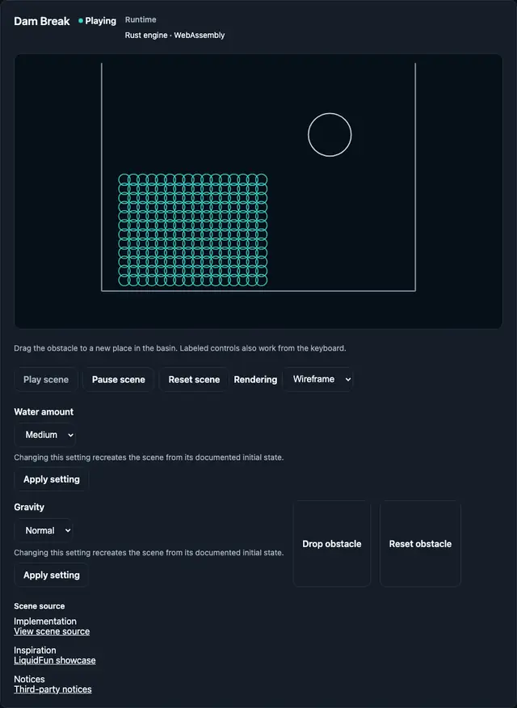
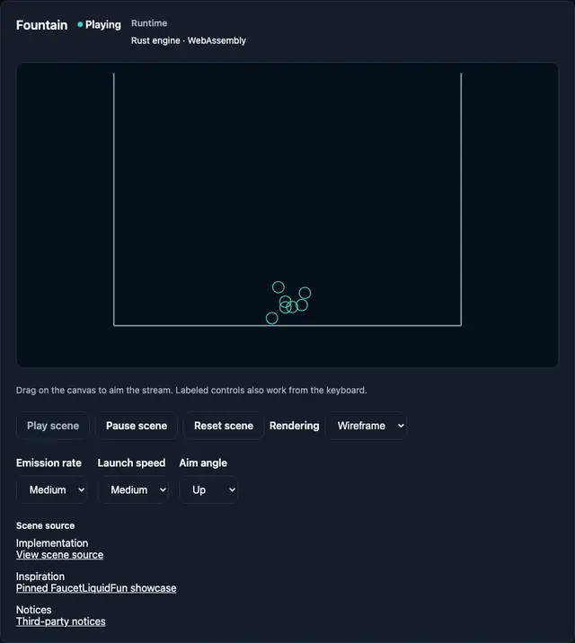
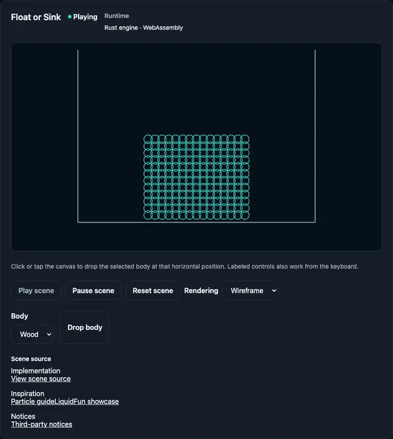
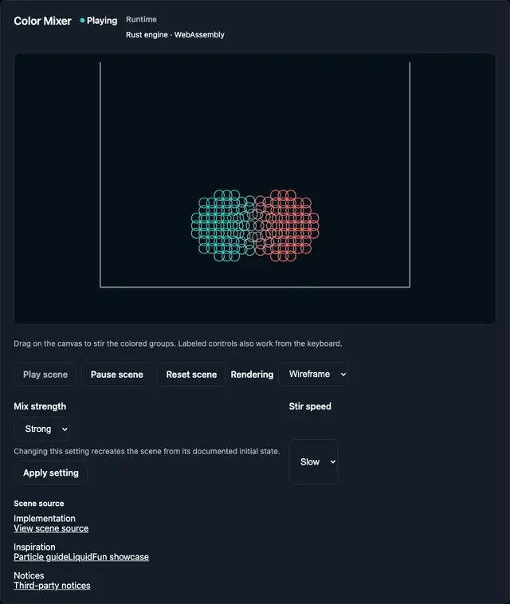
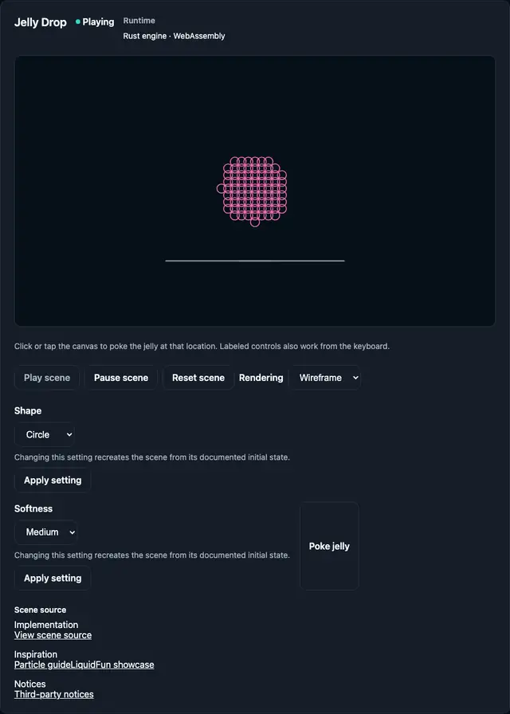
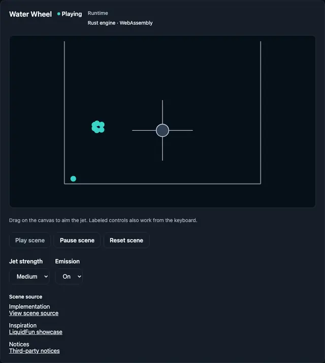

# liquidfun-rs

<!-- bright-builds-rules-readme-badges:begin -->

<!-- Managed upstream by bright-builds-rules. If this badge block needs a fix, open an upstream PR or issue instead of editing the downstream managed block. Keep repo-local README content outside this managed badge block. -->

[](https://github.com/bright-builds-llc/liquidfun-rs)
[](https://github.com/bright-builds-llc/liquidfun-rs/actions/workflows/ci.yml)
[](./LICENSE)
[](https://www.rust-lang.org/)
[](https://github.com/bright-builds-llc/bright-builds-rules)

<!-- bright-builds-rules-readme-badges:end -->

An experimental, renderer-neutral Rust implementation of Google's LiquidFun
physics engine for learning and playful simulations, developed with a pinned
C++ reference available for optional comparisons.

## Web playground

The playground has six native scenes: Dam Break, Fountain, Float or Sink,
Color Mixer, Jelly Drop, and Water Wheel. Visitors can open the hosted
playground at
<https://bright-builds-llc.github.io/liquidfun-rs/#/scene/dam-break>.
The recorded Phase 19 live revision is source
`d3d8688dabbacd54a6b0fa5fc6a055082f0bcf9e`. Production JavaScript and WASM
load under `/liquidfun-rs/`. GitHub Pages delivery is website hosting, not
Linux native qualification. This playground does not publish an npm or Rust
package, claim complete LiquidFun parity, or treat catalog cards as live
simulations. Color mixing is contact-driven particle color, not pigment
chemistry. Local Chromium `just web-player-smoke` remains the ordinary
WEBTEST-01 gate and does not claim Firefox or Safari coverage.

### Demo gallery

Each preview is generated deterministically from the Rust/WASM playground.
Select a preview for the full MP4 recording, or open the linked live scene.

#### [Dam Break](https://bright-builds-llc.github.io/liquidfun-rs/#/scene/dam-break)

[](docs/assets/demos/dam-break.mp4)

#### [Fountain](https://bright-builds-llc.github.io/liquidfun-rs/#/scene/fountain)

[](docs/assets/demos/fountain.mp4)

#### [Float or Sink](https://bright-builds-llc.github.io/liquidfun-rs/#/scene/float-or-sink)

[](docs/assets/demos/float-or-sink.mp4)

#### [Color Mixer](https://bright-builds-llc.github.io/liquidfun-rs/#/scene/color-mixer)

[](docs/assets/demos/color-mixer.mp4)

#### [Jelly Drop](https://bright-builds-llc.github.io/liquidfun-rs/#/scene/jelly-drop)

[](docs/assets/demos/jelly-drop.mp4)

#### [Water Wheel](https://bright-builds-llc.github.io/liquidfun-rs/#/scene/water-wheel)

[](docs/assets/demos/water-wheel.mp4)

The private, unpublished `liquidfun-wasm` wrapper and SolidJS player rebuild
from a clean checkout with the exact local tools:

```bash
rustup target add wasm32-unknown-unknown --toolchain 1.97.0
cargo install wasm-pack --version 0.15.0 --locked
curl -fsSL https://bun.com/install | bash -s "bun-v1.4.2"
cd web && bun install --frozen-lockfile
cd .. && just web-build
just web-player-smoke
```

`just web-build` regenerates the current checkout's WASM package and the
production site. `just web-player-smoke` is the local WEBTEST-01 gate: Chromium
against the production-base `/liquidfun-rs/` build exercises all six scenes,
playback and reset, one representative pointer gesture plus a labeled control,
pointercancel, resize-then-drag, hidden-tab recovery, and a 375px keyboard and
page-scroll pass. It does not claim Firefox or Safari coverage. `just web-smoke`
is historical Phase 16 forensic chrome. It allocates
`target/phase16/closure-attempt-N`, sets `PHASE16_CLOSURE_ATTEMPT_DIR`, and
still looks for Dispose-session and PNG-hash selectors. It is
not the v1.1 product gate and is
not expected to pass against current Play/Pause/Reset chrome.
Ordinary playground proof is `just web-player-smoke`.

`just demo-media` and `just demo-media-check` are separate capture workflows for
the committed README gallery assets. They are not required for ordinary web
builds or playground use, but they do require local `ffmpeg`, `ffprobe`, and
`webpmux` on `PATH`; `webpmux` is supplied by WebP tools. This Task 4 run
verified `ffmpeg` 8.1.1, `ffprobe` 8.1.1, `webpmux` 1.6.0, and the capture
profile recorded in `docs/assets/demos/manifest.json`.

`web/src/generated/liquidfun-wasm`, `web/dist`, Playwright output, and
`target/web-build` are ignored and regenerated. Ordinary native builds and the
packaged `liquidfun` crate require none of Bun, Chromium, wasm-pack, C++, or
the upstream checkout.

<!-- dam-break-animated-svg:begin -->

### Dam Break animated SVG

A 10 second loop of the default Dam Break scene from the playground's animated
SVG export. The clip uses medium water, normal gravity, the identity camera,
wireframe rendering, and the demo gallery's 1280 by 960 frame. A post-merge
workflow regenerates the file and does not commit when the export matches
this copy.

[](docs/assets/demos/dam-break-10s.svg)

<!-- dam-break-animated-svg:end -->

## Hobby development

The goal is an enjoyable, useful experimental physics project. Linux x64
qualification and a dedicated benchmark machine are optional; they do not block
ordinary development or completion. Start with the Cargo-only commands below.
Current Cargo CI runs one macOS smoke job; cross-platform and expensive checks are manual options.
See [project scope](PROJECT-SCOPE.md) for accepted decisions and the
[experimental preparation checklist](RELEASE.md#experimental-package-preparation).
APIs may evolve; incompatible changes will be documented before release.
Safe handles, checked mutation and native Cargo-only consumption remain core boundaries.

## Maturity and evidence

The publishable crate is still version `0.0.0`; this repository has not declared
a parity-bearing v1 release candidate. The native scalar engine includes math,
collision, rigid bodies, contacts, CCD, all eleven joint kinds, standalone rope,
particles and groups, queries, semantic observations, debug primitives, and
safe owned particle-buffer transfer.

Capability is not the same as verified parity. The generated
[compatibility inventory](COMPATIBILITY.md) is authoritative for row-by-row
implementation, differential, platform, and documented-difference evidence.
Historical Phase 4 through Phase 8 corpora remain bounded evidence inputs, not
a generalized claim about the complete project. Performance claims likewise
apply only to immutable reports for named workloads.

The optional strict qualification profile for a parity-bearing release requires a frozen full candidate commit and a complete
reviewed manifest accepted by fail-closed `cargo xtask release audit`. This
checkout is **not release-ready**: it has no completed full-SHA
`release-candidate` workflow run, retained complete evidence bundle, or tracked
source/manifest/report records accepted by
`cargo xtask release attestation validate`. Local green checks do not substitute
for that run-bound attestation. See [RELEASE.md](RELEASE.md) for the
non-publication rule and the exact path to a future readiness claim.

## Cargo-only install and use

The crate declares Rust 1.92.0 as its minimum compiler; verify that minimum
before publication. A durable MSRV guarantee is deferred. Repository
development is reproducibly pinned to Rust 1.97.0 by `rust-toolchain.toml`.
Until a public release is published, build the reviewed repository checkout:

```bash
cargo build -p liquidfun
cargo test -p liquidfun --all-features
```

Ordinary use is Cargo-only. It does not initialize the upstream submodule,
discover CMake, compile C++, start an oracle process, or include the private
testbed:

```rust
use liquidfun::math::Vec2;
use liquidfun::{BodyDef, BodyType, World};

fn main() -> Result<(), Box<dyn std::error::Error>> {
    let mut world = World::new()?;
    let body = world.create_body(&BodyDef::new(
        BodyType::Dynamic,
        Vec2::ZERO,
        0.0,
        true,
    )?)?;
    assert!(world.contains_body(body));
    Ok(())
}
```

## Platform support

Ordinary CI exercises macOS; this is tested coverage, not a platform warranty.
Non-macOS platforms are best effort and can be tested manually as needed.
This table describes the existing optional strict platform profile. Linux x64
is not a requirement for hobby-project completion; the recorded results remain
scoped evidence, not a promise about every later revision.

Every supported lane verifies the same reviewed `.crate` bytes. Platform
results are D2 portability evidence and cannot create or promote canonical D1
physics fixtures.

| Target                      | Policy tier             | Current contract                                                                                                              |
| --------------------------- | ----------------------- | ----------------------------------------------------------------------------------------------------------------------------- |
| `x86_64-unknown-linux-gnu`  | durable supported       | Rust 1.97 native verification; canonical Linux also verifies Rust 1.92.0                                                      |
| `aarch64-unknown-linux-gnu` | durable supported       | Rust 1.97 native verification                                                                                                 |
| `aarch64-apple-darwin`      | durable supported       | Rust 1.97 native verification                                                                                                 |
| `x86_64-pc-windows-msvc`    | durable supported       | Rust 1.97 native verification                                                                                                 |
| `x86_64-apple-darwin`       | `conditional_supported` | Requires native evidence no older than 90 days; missing or expired evidence downgrades the current disposition to unsupported |

Targets outside this table are evidence-only unless a reviewed support decision
promotes them.

## Headless, catalog, and testbed workflows

The catalog is the shared renderer-independent scenario authority:

```bash
cargo xtask catalog list
cargo xtask catalog run --scenario rigid-stack-stability --timestep 0.016666668 --velocity-iterations 8 --position-iterations 3 --particle-iterations 1 --oracle-preset oracle-debug --session-profile one-shot --output human --commands auto
```

The private testbed consumes the same semantic catalog and cannot confer parity
or performance authority:

```bash
cargo run -p liquidfun-testbed -- --capability-check --fixture crates/liquidfun-differential/tests/fixtures/catalog/phase11-v1.json --output target/testbed-capability
cargo run -p liquidfun-testbed --bin interactive
```

See [TESTING.md](TESTING.md) for replay, differential, sanitizer, fuzz, Miri,
coverage, benchmark, and evidence-promotion workflows.

## Optional C++ oracle

Maintainer-only differential work requires the exact recursive upstream
checkout, CMake 3.25 or newer, Ninja 1.11 or newer, and a compatible C++
compiler:

```bash
git submodule update --init --recursive third_party/liquidfun
cargo xtask upstream verify
cargo xtask upstream configure --preset oracle-debug
cargo xtask upstream build --preset oracle-debug
```

Canonical Linux evidence records the stricter pinned identities documented in
[UPSTREAM.md](UPSTREAM.md). The C++ oracle is out of process and never enters
the `liquidfun` crate.

## Contributing and licensing

Read [CONTRIBUTING.md](CONTRIBUTING.md) before changing source, evidence, or
generated reports. Original project work is MIT-licensed under [LICENSE](LICENSE).
Pinned upstream and derived materials retain separate attribution, alteration,
and notice duties recorded in
[THIRD_PARTY_NOTICES.md](THIRD_PARTY_NOTICES.md).

## Architecture and evidence

- [UPSTREAM.md](UPSTREAM.md) — immutable oracle identity, ancestry, notices,
  and intentional update policy
- [COMPATIBILITY.md](COMPATIBILITY.md) — generated inventory and explicit
  evidence gaps
- [ARCHITECTURE.md](ARCHITECTURE.md) — native Rust dependency direction and
  oracle-isolation boundary
- [TESTING.md](TESTING.md) — local commands, CI lanes, package proof, and
  deterministic verification policy
- [SAFETY.md](SAFETY.md) — handle, callback, owned-buffer, panic, and zero-unsafe
  contracts
- [RELEASE.md](RELEASE.md) — candidate freeze, audit, package reuse, and
  non-publication policy
